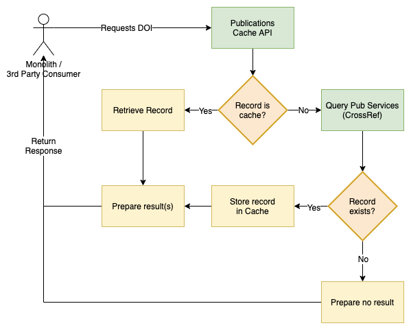

# Publications Caching API (SOLUTION)

This is a Laravel-based web application that retrieves publication data from CrossRef and caches it locally.

## Getting Started

Follow these instructions to deploy and run the application on your local machine.

### Prerequisites

- PHP 7.4 or higher
- Composer
- SQLite or another supported database

### Installation

#### Clone the Repository
```
git clone https://github.com/uydev/publications-caching-api.git
cd publications-caching-api
```
#### Install Dependencies
```
composer install
```

#### Set Up Environment Variables
```
cp .env.example .env
```

#### Generate Application Key
```
php artisan key:generate
```

#### Run Migrations
```
php artisan migrate
```

#### Serve the Application
```
php artisan serve
```

### Run the PHPUnit Tests
```
php artisan test
```

### Run Manual Tests

Here are examples of how to test the API with different DOIs:
```
curl http://localhost:8000/publications?doi=10.1038/nphys1170
```

```
curl http://localhost:8000/publications?doi=10.1200/jco.2007.25.18_suppl.3507
```

```
curl http://localhost:8000/publications?doi=10.31838/srp.2020.5.28
```

---


# Publications Caching API (TASK)

A simple publications / doi* caching api in order to maintain a single source of truth for a variety publications sources.

[Digital object identifier - Wikipedia](https://en.wikipedia.org/wiki/Digital_object_identifier)

The aim of the API will be allow 3rd parties to query using a correctly formated full or partial DOI. If the record exists in the cache server the record or records are returned, otherwise the API will poll the publications data provider. For the purpose of the exercise you should use CrossRef. A link has been provided below.

## Requirements
- Build a simple API that can:
  - Accept requests from a consumer in form of DOI id or partial DOI id 
  - Use the DOI to check a local database or cache in order to check if that publication exists in the data repo
  - If the record already exists return the record
  - If no record exists try pull the record from CrossRef, storing the result in the cache and returning the result

Once you have completed this exercise, please answer the follow up questions provided in the `FOLLOW-UP.md` file.



## Task requirements
Building a RESTful API / micro-service in order to support the required functionality. The project can be written in any approved Java, GoLang, PHP or Ruby framework, and should either provide detailed explaination around devops requirements and/or access to a pre-configured environment in order to demonstrate the suitability.

Feel free to provide any supporting documentation and/or explainations in order to explain / validate choices that you make. Other considerations for the API should be indicated in supporting documentation.

This project should take about _3-4 hours_.

### Resources:
- CrossRef public API documentation
  [GitHub - CrossRef/rest-api-doc: Documentation for Crossref's REST API. Issues moved to https://gitlab.com/crossref/issues](https://github.com/CrossRef/rest-api-doc)
